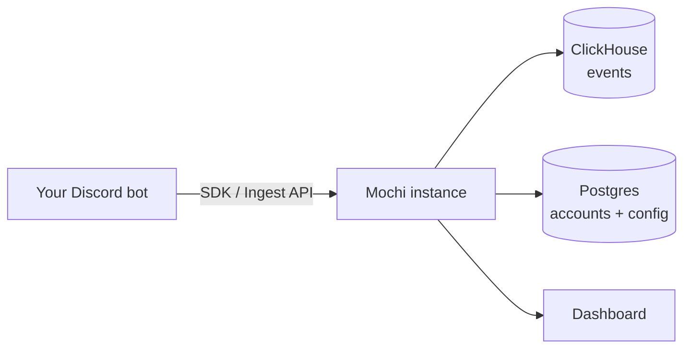

import { Cards } from 'nextra/components'

# Mochi

Self-hosted analytics for Discord bots: command usage, server growth, and bot
health in one dashboard. You run it, you own the data.

## Features

- **Privacy-friendly** — raw user ids are hashed server-side with a per-bot salt
  and never stored.
- **Command analytics** — usage counts, success rate, latency, and unique-user
  metrics.
- **Growth tracking** — guild joins, leaves, and churn over time.
- **Custom events** — attach your own metadata for anything the built-in events
  don't cover.
- **Realtime activity feed** — watch events land as they happen.
- **Public share links** — read-only dashboards you can hand to your community.
- **Per-bot controls** — API keys, retention settings, and salt rotation.

## How it works

A bot sends events to your Mochi instance through one of the SDKs (or the raw
[Ingest API](/ingest-api)). Mochi stores them in ClickHouse, hashes user ids so
you never hold raw identifiers, and renders everything in a Next.js dashboard.

## Next steps

<Cards num={2}>
  <Cards.Card title="Self-Hosting" href="/self-hosting" arrow />
  <Cards.Card title="discord.js SDK" href="/sdks/discordjs" arrow />
  <Cards.Card title="discord.py SDK" href="/sdks/discordpy" arrow />
  <Cards.Card title="Ingest API" href="/ingest-api" arrow />
</Cards>

## License

The Mochi server is licensed under `AGPL-3.0-or-later`. The SDKs are
`Apache-2.0`. The Mochi name, logos, and branding are not covered by these
licenses and may not be used to imply endorsement or to operate a confusingly
similar hosted service.
