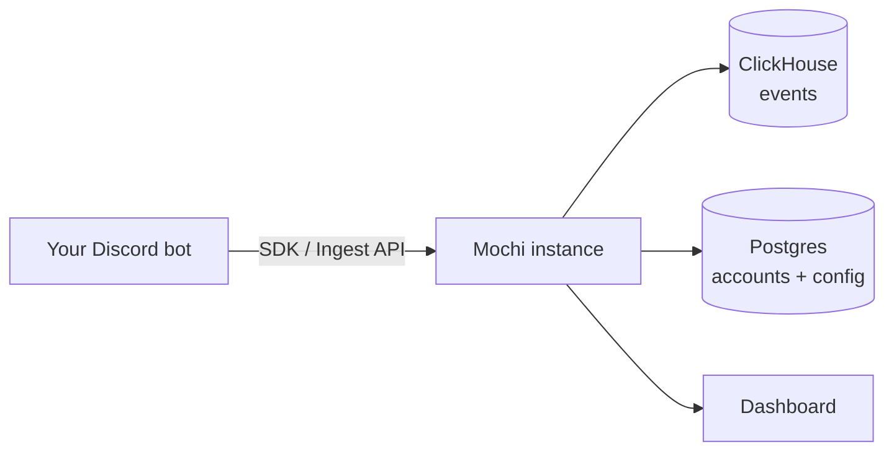

import { Cards, Callout } from 'nextra/components'

# Mochi

Analytics for Discord bots: command usage, server growth, and bot health in one
dashboard. Self-host it and own the data, or use the managed cloud.

<Callout type="info">
  **Don't want to self-host?** [Mochi Cloud](https://cloud.mochi.software) is a
  fully managed, multi-tenant instance of the same open-source Mochi — sign in
  with Discord and start sending events, no infrastructure required.
</Callout>

## Features

- **Privacy-friendly** — raw user ids are hashed server-side with a per-bot salt
  and never stored.
- **Command analytics** — usage counts, success rate, latency, and unique-user
  metrics.
- **Growth tracking** — guild joins, leaves, and churn over time, with
  previous-period comparison.
- **Custom events** — attach your own metadata for anything the built-in events
  don't cover, and explore it per event.
- **Error tracking** — error events, failing commands, and affected users.
- **Health dashboard** — per-shard status, gateway ping, and uptime.
- **[Alerts & digests](/alerts)** — Discord webhook alerts for downtime, error
  spikes, and server drops, plus a weekly summary.
- **Realtime activity feed** — watch events land as they happen.
- **[Sharing & embeds](/sharing)** — public read-only dashboards, README badges,
  and embeddable widgets.
- **[Exports](/exports) and a [Stats API](/stats-api)** — pull your numbers out
  as CSV, JSON, or straight into a `/stats` command.
- **Per-bot controls** — API keys, retention settings, and salt rotation.

## How it works

A bot sends events to your Mochi instance through one of the SDKs (or the raw
[Ingest API](/ingest-api)). Mochi stores them in ClickHouse, hashes user ids so
you never hold raw identifiers, and renders everything in a Next.js dashboard.

## Community & support

Questions, bug reports, or feature ideas? Join the
[Mochi Discord](https://discord.gg/59z89Ke4bt) — it's the fastest way to get
help and talk to the people building Mochi. You can also
[open an issue](https://github.com/mochi-analytics/mochi/issues) on GitHub.

## Next steps

<Cards num={2}>
  <Cards.Card title="Mochi Cloud" href="https://cloud.mochi.software" arrow />
  <Cards.Card title="Discord community" href="https://discord.gg/59z89Ke4bt" arrow />
  <Cards.Card title="Self-Hosting" href="/self-hosting" arrow />
  <Cards.Card title="SDKs" href="/sdks" arrow />
  <Cards.Card title="Ingest API" href="/ingest-api" arrow />
  <Cards.Card title="Stats API" href="/stats-api" arrow />
</Cards>

## License

The Mochi server is licensed under `AGPL-3.0-or-later`. The SDKs are
`Apache-2.0`. The Mochi name, logos, and branding are not covered by these
licenses and may not be used to imply endorsement or to operate a confusingly
similar hosted service.
